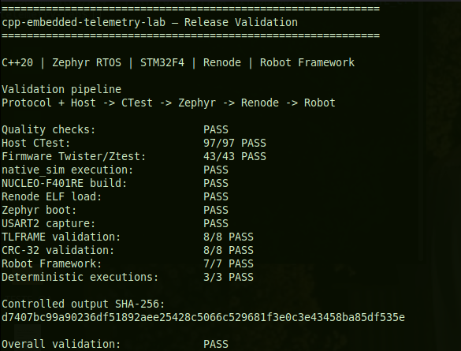

# Embedded Telemetry Lab

Laboratório C++20 para telemetria binária portátil, com pipeline host e
firmware Zephyr concorrentes, determinísticos e testáveis.

## Status

**Zephyr Firmware Telemetry Producer:** o Protocol Core v1 é compartilhado por
uma aplicação host e por um firmware Zephyr C++20. O firmware gera oito
amostras determinísticas, serializa frames de 34 bytes, usa uma `k_msgq`
estática e duas threads, transmite oito linhas `TLFRAME` e termina com métricas
validadas.

Hardware físico, transportes reais e fault injection avançado ainda não estão
implementados.

## Arquitetura

```text
Protocol Core v1
  ├─ Host Pipeline
  │   SimulatedFrameSource -> FrameIngestor -> SafeConcurrentBuffer
  │   -> TelemetryProcessor -> TelemetryMetrics -> Text Report
  └─ Firmware Producer
      DeterministicSensorModel -> TelemetryProducer -> serialize
      -> Zephyr k_msgq -> TelemetryTransmitter -> TLFRAME
```

O frame v1 possui 34 bytes em big-endian e CRC-32. Consulte
[docs/PROTOCOL.md](docs/PROTOCOL.md) e
[docs/HOST_PIPELINE.md](docs/HOST_PIPELINE.md). A aplicação Zephyr está
documentada em [docs/FIRMWARE.md](docs/FIRMWARE.md).

## Requisitos

- CMake 3.20 ou mais recente;
- compilador C++20 compatível;
- `cpp-safe-concurrent-buffer` v0.3.0 instalado;
- Zephyr 4.4.99 e Zephyr SDK 1.0.1 para o firmware;
- `west` e uma plataforma `native_sim` disponível;
- Git e acesso à rede quando GoogleTest ainda não estiver disponível.

## Dependência externa

Instale a fila em um prefixo isolado:

```sh
DEPENDENCY_SOURCE=/path/to/cpp-safe-concurrent-buffer
DEPENDENCY_BUILD=/tmp/cpp-safe-concurrent-buffer-build
DEPENDENCY_PREFIX=/tmp/cpp-safe-concurrent-buffer-v030

cmake -S "${DEPENDENCY_SOURCE}" -B "${DEPENDENCY_BUILD}" \
  -DCMAKE_BUILD_TYPE=Release \
  -DBUILD_TESTING=OFF \
  -DBUILD_BENCHMARKS=OFF \
  -DCMAKE_INSTALL_PREFIX="${DEPENDENCY_PREFIX}"
cmake --build "${DEPENDENCY_BUILD}" --parallel
cmake --install "${DEPENDENCY_BUILD}"
```

O projeto consome somente o pacote instalado por
`find_package(cpp_safe_concurrent_buffer 0.3 REQUIRED)` e pelo target
`cpp_safe_concurrent_buffer::concurrent_buffer`.

## Build com testes

```sh
cmake -S . -B build-gcc \
  -DCMAKE_BUILD_TYPE=Debug \
  -DBUILD_TESTING=ON \
  -DCMAKE_PREFIX_PATH="${DEPENDENCY_PREFIX}"
cmake --build build-gcc --parallel
ctest --test-dir build-gcc --output-on-failure
```

## Build mínima

Esta configuração não obtém nem compila GoogleTest:

```sh
cmake -S . -B build-minimal \
  -DCMAKE_BUILD_TYPE=Release \
  -DBUILD_TESTING=OFF \
  -DCMAKE_PREFIX_PATH="${DEPENDENCY_PREFIX}"
cmake --build build-minimal --parallel
```

## Execução

```sh
./build-gcc/host/telemetry_host_demo
```

Frames inválidos fazem parte do cenário normal e não causam código de saída
de erro. Falhas operacionais inesperadas retornam valor diferente de zero.

## Firmware Zephyr

Build e execute no `native_sim`:

```sh
west build -b native_sim firmware -d build-v030-zephyr-native --pristine
./build-v030-zephyr-native/zephyr/zephyr.exe -no-rt
```

Compile para a NUCLEO-F401RE sem gravar a placa:

```sh
west build -b nucleo_f401re firmware \
  -d build-v030-zephyr-nucleo --pristine
```

Checkouts com espaços no caminho exigem o procedimento de build externo
descrito em [docs/FIRMWARE.md](docs/FIRMWARE.md), devido a uma limitação do
Zephyr 4.4.99.

## Renode Firmware Validation

The Zephyr firmware built for `nucleo_f401re` is executed as an ARM ELF inside
a headless Renode Cortex-M4 platform. Its USART2 output is captured and
validated automatically with Robot Framework, including protocol structure,
sequencing, CRC-32 and deterministic completion.

```text
Zephyr Firmware
      ↓
ARM ELF
      ↓
Renode Cortex-M4
      ↓
Emulated USART2
      ↓
TLFRAME Capture
      ↓
Protocol and CRC Validation
      ↓
Robot Framework Reports
```

### Validation Results

| Validation | Result |
|---|---|
| Protocol tests | 29/29 PASS |
| Host tests | 67/67 PASS |
| Host smoke test | 1/1 PASS |
| Host CTest total | 97/97 PASS |
| Firmware Twister/Ztest | 43/43 PASS |
| Robot Framework | 7/7 PASS |
| Captured TLFRAME records | 8/8 PASS |
| CRC-32 validation | 8/8 PASS |
| native_sim execution | PASS |
| NUCLEO-F401RE build | PASS |
| Renode ELF loading | PASS |
| Zephyr boot in Renode | PASS |
| USART2 console capture | PASS |
| Deterministic executions | 3/3 identical |

The Host CTest total is preserved as a separately reported validation result;
it is not calculated here from the individual Protocol, Host and smoke counts.

### Release Validation

The complete release validation pipeline passed successfully, covering Host CTest, Zephyr Twister/Ztest, `native_sim`, NUCLEO-F401RE, Renode Cortex-M4 emulation, USART2 capture, CRC-32 validation, Robot Framework and deterministic execution.

<details>
<summary>View terminal validation result</summary>

<br>

<p align="center">
  
</p>

</details>

### Telemetry Frame Validation

Each captured frame is validated for:

- index from `0001` through `0008`;
- exactly 68 hexadecimal characters;
- a 34-byte binary frame;
- magic `544C`;
- version `01`;
- message type `01`;
- payload size `000C`;
- sequence values from 1000 through 1007;
- CRC-32 integrity;
- preserved transmission order.

| CRC-32 property | Value |
|---|---|
| Polynomial | Reflected `0xEDB88320` |
| Initial value | `0xFFFFFFFF` |
| Final XOR | `0xFFFFFFFF` |
| Coverage | First 30 bytes |
| Stored CRC | Final four bytes, big-endian |

### Controlled Output

<details>
<summary>View deterministic firmware output</summary>

```text
TLFRAME 0001 544C0101000C000003E800000000000F4240FFFFEA84000180C40B54000085599092
TLFRAME 0002 544C0101000C000003E900000000001312D000000000000186A00CE400018A4C876C
TLFRAME 0003 544C0101000C000003EA000000000016E360000030D4000189C00C4E0002954F1074
TLFRAME 0004 544C0101000C000003EB00000000001AB3F0000059D800018BCD0CE400043F14B6C9
TLFRAME 0005 544C0101000C000003EC00000000001E848000007B0C00018ED40CB20008F6997EB3
TLFRAME 0006 544C0101000C000003ED00000000002255100000AFC8000184AC0AF00003D7449939
TLFRAME 0007 544C0101000C000003EE00000000002625A000004844000188940BB8000C8E1C7527
TLFRAME 0008 544C0101000C000003EF000000000029F6300000697800018DA80D1600002A874BCC
TLFIRMWARE SUMMARY produced=8 transmitted=8 queue_errors=0
TLFIRMWARE DONE
```

</details>

### Deterministic Execution

Three independent Renode executions produced byte-for-byte identical
controlled output.

SHA-256:
`d7407bc99a90236df51892aee25428c5066c529681f3e0c3e43458ba85df535e`

The controlled output also matches the deterministic result observed in
`native_sim`; this does not imply complete equivalence between emulation and
physical hardware.

### Target Configuration

| Property | Value |
|---|---|
| Zephyr board | `nucleo_f401re` |
| MCU family | STM32F4 |
| CPU | ARM Cortex-M4 |
| Flash base | `0x08000000` |
| Flash capacity | 512 KiB |
| RAM base | `0x20000000` |
| RAM capacity | 96 KiB |
| Console | USART2 |
| USART2 address | `0x40004400` |
| USART2 IRQ | 38 |
| Baud rate | 115200 |

### Firmware Resource Usage

| Resource | Used | Available | Usage |
|---|---:|---:|---:|
| Flash | 30,624 bytes | 512 KiB | 5.84% |
| RAM | 12,428 bytes | 96 KiB | 12.64% |

### Running the Validation

Activate the Zephyr environment and make Renode 1.16.1 plus its Robot
environment available, then run:

```sh
./tools/build-renode-firmware.sh --rebuild
./tools/run-renode-validation.sh --rebuild
./tools/run-renode-robot.sh --rebuild
```

The first command generates and verifies the Zephyr ARM ELF. The second runs
the bounded headless validation. The third executes the seven Robot Framework
tests and generates the reports.

| Variable | Purpose |
|---|---|
| `RENODE_HOME` | Directory containing the Renode executables; otherwise they are resolved from `PATH`. |
| `RENODE_BUILD_DIR` | Configurable temporary Zephyr build directory. |
| `RENODE_RESULTS_DIR` | Configurable temporary capture and report directory. |
| `ZEPHYR_BASE` | Active Zephyr checkout required by the firmware build. |

### Robot Framework Reports

Each Robot execution generates:

- `robot_output.xml`;
- `output.xml`;
- `log.html`;
- `report.html`.

These files are generated in a temporary or `RENODE_RESULTS_DIR`-configured
directory and are not versioned.

### Emulation Scope

The Renode platform models the CPU, memory regions, USART2 and the peripherals
required by the current firmware workload. It is not intended to represent
every STM32F401RE peripheral or all silicon-level behavior.

Known limitations involving RCC, NVIC, flash-controller, debug registers and
clock fidelity are documented in [docs/RENODE.md](docs/RENODE.md).

- no physical flashing;
- no hardware-in-the-loop;
- no real sensor acquisition;
- no claim of complete silicon equivalence.

### Renode Documentation

- [Renode validation design and evidence](docs/RENODE.md)
- [Mission 4 plan and acceptance criteria](docs/RENODE_MISSION_PLAN.md)
- [Renode local execution guide](renode/README.md)

## Continuous Integration

The `Embedded Telemetry CI` workflow validates Host CTest, firmware
Twister/Ztest, deterministic `native_sim` execution, the NUCLEO-F401RE build,
headless Renode and USART2 capture, Protocol v1 CRC-32, Robot Framework and
three identical executions. It runs for `main`, pull requests, version tags and
manual dispatch without flashing hardware or publishing releases.

Run the equivalent local validation and present an approved report with:

```sh
./tools/run-release-validation.sh --rebuild
./tools/present-release-validation.sh
```

See [docs/CI.md](docs/CI.md) for job dependencies, pinned toolchains, artifact
retention, security controls and recording commands.

## Testes

```sh
# 97 testes host
ctest --test-dir build-gcc --output-on-failure

# 43 testes Ztest no native_sim
west twister -T tests/firmware -p native_sim \
  --outdir build-v030-twister
```

Plataformas validadas:

- `native_sim/native`: build, execução determinística e Twister;
- `nucleo_f401re/stm32f401xe`: build ARM e geração de artefatos, sem execução
  física.

## Demo

Execute a demonstração limpa ou a apresentação completa:

```sh
./tools/run-firmware-demo.sh
./tools/present-firmware-demo.sh
```

Consulte [docs/GIF_DEMO.md](docs/GIF_DEMO.md) para preparar uma gravação curta.

## Sanitizers

Use builds separadas e acrescente, conforme o diagnóstico desejado:

```sh
-DCMAKE_CXX_FLAGS="-fsanitize=address,undefined -fno-omit-frame-pointer"
-DCMAKE_EXE_LINKER_FLAGS="-fsanitize=address,undefined"
```

ou:

```sh
-DCMAKE_CXX_FLAGS="-fsanitize=thread -fno-omit-frame-pointer"
-DCMAKE_EXE_LINKER_FLAGS="-fsanitize=thread"
```

## Roadmap

Etapas futuras poderão adicionar integração contínua, transportes e fault
injection. Esses componentes não fazem parte do estado atual.


## License

This project is released under the MIT License. See the [`LICENSE`](LICENSE) file for details.
